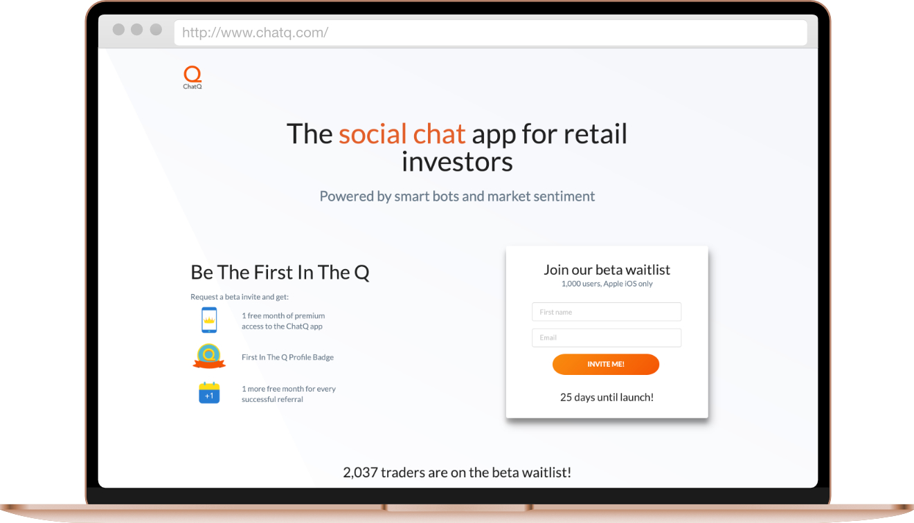

Chat Q is a social chat app that allows investors to get insight from reputable community members.

I built a single page app to generate unique referral URLs for their beta testers when they signed up, rewarding them accordingly for each referral they made.

The front-end was built using React.js and Next.js. It used the Viral Loop API to track and reward each individual referral.
