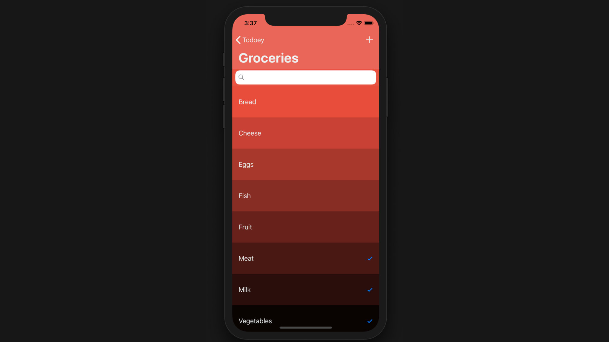

Todoey is a Todo app for iOS built on Swift, and was done as part of the iOS App Development Bootcamp on Udemy.

### Persisting data using Core Data vs Realm

### Modeling data categories

### App Delegates